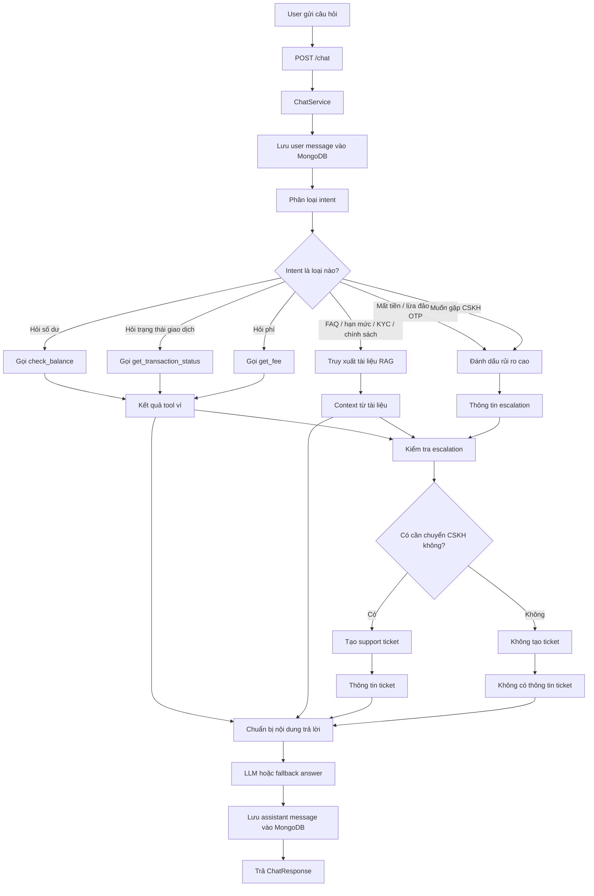

# 💳 VSmartPay AI Support Agent (Trợ Lý Hỗ Trợ Khách Hàng Ảo Thông Minh)

**VSmartPay AI Support Agent** là hệ thống Trợ lý ảo hỗ trợ khách hàng thông minh dành riêng cho ví điện tử **VSmartPay**. Dự án được xây dựng dựa trên kiến trúc **Retrieval-Augmented Generation (RAG)** kết hợp công nghệ điều phối đa tác nhân **LangGraph (Multi-Agent Orchestration)**, giúp tự động giải quyết các thắc mắc nghiệp vụ tài chính của khách hàng, tích hợp các công cụ ví điện tử giả lập, đồng thời tự động phát hiện rủi ro bảo mật và chuyển giao (escalate) thông minh cho bộ phận CSKH thực tế.

---

## 🗺️ 1. Kiến trúc Hệ thống (System Architecture)
### Luồng hoạt động của dự án sử dụng LangGraph (Flowchart)


---

<!-- ## 🧩 2. Mô tả Chi tiết các Tác nhân (Agent Components Detail)

Hệ thống được thiết kế dưới dạng máy trạng thái hữu hạn sử dụng `StateGraph` từ LangGraph với các node xử lý độc lập:

1. **Injection Guard (`injection_guard_node`)**: Node chốt chặn bảo mật ở cửa ngõ. Phát hiện các hành vi Jailbreak hoặc Prompt Injection (ví dụ: `"ignore previous instructions"`) và ngay lập tức chuyển giao trạng thái khẩn cấp.
2. **Intent Agent (`intent_agent_node`)**: Phân loại ý định khách hàng thành một trong 14 nhóm ý định nghiệp vụ với độ tin cậy từ 0.0 đến 1.0 dựa trên heuristics và phân tích ngữ nghĩa.
3. **RAG Agent (`rag_agent_node`)**: Thực hiện tìm kiếm ngữ nghĩa trên cơ sở tri thức (MongoDB Atlas/FAISS), giới hạn phạm vi tìm kiếm theo phân loại tài liệu (`kb_type`) và nhóm tác vụ (`agent_scope`) để triệt tiêu nhiễu dữ liệu.
4. **Clarification Agent (`clarification_agent_node`)**: Tự động kích hoạt khi thông tin khách hàng cung cấp bị thiếu hụt hoặc mơ hồ, đưa ra câu hỏi gợi ý tinh tế thay vì trả lời sai lệch.
5. **Escalation Agent (`escalation_agent_node`)**: Xử lý các tình huống khẩn cấp, tự động ghi nhận Ticket hỗ trợ độ ưu tiên cao (`HIGH`) trực tiếp vào MongoDB và thông báo kết nối với nhân viên CSKH con người.
6. **Grounding Guard (`grounding_guard_node`)**: Kiểm tra chéo câu trả lời nháp đối chiếu với các nguồn tài liệu được trả về. Nếu phát hiện thông tin tự suy diễn (Hallucination), sẽ lập tức gắn cờ bác bỏ câu trả lời ảo giác và chuyển tiếp sang Clarification Agent.

---

## 🗂️ 3. Danh mục Ý định (Intent Taxonomy)

Hệ thống nhận diện và xử lý chính xác 14 nhóm ý định nghiệp vụ tài chính:

*   **Nhóm Nghiệp vụ & Tra cứu**:
    *   `LIMIT_INQUIRY`: Tra cứu hạn mức nạp, rút, chuyển tiền.
    *   `FEE_INQUIRY`: Tra cứu biểu phí giao dịch của ví.
    *   `BALANCE_INQUIRY`: Hỏi về số dư khả dụng hiện tại.
    *   `TRANSACTION_STATUS`: Tra cứu trạng thái của một mã giao dịch cụ thể.
    *   `PROMOTION_INQUIRY`: Tìm hiểu các ưu đãi, khuyến mãi đang áp dụng.
    *   `KYC_SUPPORT`: Hướng dẫn xác thực danh tính, định danh tài khoản.
    *   `BANK_LINKING`: Hướng dẫn liên kết hoặc hủy liên kết thẻ/tài khoản ngân hàng.
    *   `FAQ_GENERAL`: Các câu hỏi thường gặp chung khác.
*   **Nhóm Sự cố & Bảo mật (Khẩn cấp)**:
    *   `FAILED_TRANSACTION`: Giao dịch bị báo lỗi thất bại nhưng tài khoản bị trừ tiền.
    *   `ACCOUNT_SECURITY`: Nghi ngờ lộ mã OTP, mất mật khẩu, yêu cầu khóa ví.
    *   `FRAUD_OR_SCAM_REPORT`: Khách hàng báo cáo bị lừa đảo hoặc kẻ xấu gian lận tiền.
    *   `HUMAN_SUPPORT_REQUEST`: Yêu cầu trực tiếp gặp nhân viên CSKH thật.
*   **Nhóm Phụ trợ**:
    *   `OUT_OF_SCOPE`: Các câu hỏi không liên quan đến ví (ví dụ: thời tiết, sửa xe, nấu ăn...).
    *   `GREETING`: Chào hỏi thông thường.

---

## 🚨 4. Chính sách Chuyển tiếp CSKH (Escalation Policies)

Hệ thống áp dụng các quy tắc chuyển tiếp chặt chẽ:

1.  **Quy tắc Cứng (Hard Escalation)**: Lập tức chuyển giao sang CSKH thực tế (tạo Ticket độ ưu tiên `HIGH` trong MongoDB và từ chối trả lời tự động) đối với các ý định nhạy cảm bảo mật:
    *   Phát hiện tấn công Prompt Injection (`injection_detected = True`).
    *   Ý định báo cáo lừa đảo (`FRAUD_OR_SCAM_REPORT`).
    *   Lộ mã OTP, bị khóa ví (`ACCOUNT_SECURITY` khẩn cấp).
    *   Khách hàng yêu cầu gặp người thật (`HUMAN_SUPPORT_REQUEST`).
2.  **Quy tắc Nghiệp vụ (Business Escalation)**: Chuyển tiếp ngay lập tức khi phát hiện lỗi hệ thống:
    *   Giao dịch có trạng thái `FAILED` hoặc `PENDING` quá hạn trong ví giả lập.
3.  **Quy tắc Mềm (Soft Escalation)**: Chuyển tiếp sang nhân viên hỗ trợ với mức ưu tiên `LOW` khi:
    *   Độ tin cậy phân loại ý định thấp hơn ngưỡng 60% (`confidence < 0.6`).
    *   Hệ thống RAG tìm kiếm không thấy tài liệu phù hợp (`context_insufficient = True`).
    *   Câu hỏi nằm ngoài phạm vi hỗ trợ (`OUT_OF_SCOPE`). -->

---

<!-- ## 🛠️ 5. Tích hợp Ví Điện tử Giả lập (Mock Wallet Tools)

Để đảm bảo tính xác thực tuyệt đối của dữ liệu giao dịch và số dư, Support Agent tích hợp trực tiếp 3 API giả lập (Mock Tools) thay vì để LLM tự trả lời:

1.  **`check_balance(user_id)`**: Trả về số dư chính xác của khách hàng kèm loại tiền tệ (mặc định số dư tài khoản `user_001` là **2.500.000 VND**).
2.  **`get_transaction_status(transaction_id)`**: Tra cứu trạng thái giao dịch thời gian thực theo mã ID (ví dụ: `tx_001` trả về trạng thái `SUCCESS`, `tx_003` trả về `FAILED` kích hoạt tự động tạo Ticket hỗ trợ).
3.  **`get_fee(transaction_type, amount)`**: Trả về biểu phí áp dụng chính xác cho từng loại giao dịch (ví dụ: Phí rút tiền mặc định là **1.100 VND**, phí nạp tiền và chuyển tiền là **0 VND**). -->

---

<!-- ## 📊 6. Đánh giá Hiệu năng (Evaluation & Benchmark Metrics)

Kết quả so sánh side-by-side giữa luồng **Legacy RAG** và **Multi-Agent LangGraph** thực thi trên bộ dữ liệu kiểm định gồm **45 trường hợp thực tế** (`data/eval/golden_qa.jsonl` và `data/eval/escalation_cases.jsonl`):

| Chỉ số đo lường (Metric) | Luồng RAG Truyền thống (Legacy) | Luồng LangGraph Đa Tác vụ (Multi-Agent) | Ý nghĩa nghiệp vụ |
| :--- | :---: | :---: | :--- |
| **Intent Accuracy** | **75.56%** | **75.56%** | Tỷ lệ phân loại chính xác ý định khách hàng |
| **Recall @ K** | **66.67%** | **24.44%** | Tỷ lệ tìm kiếm thấy tài liệu mong đợi |
| **Groundedness Rate** | **93.33%** | **35.56%** | Tỷ lệ câu trả lời có dẫn nguồn đáng tin cậy |
| **Hallucination Rate** | **6.67%** | **64.44%** | Tỷ lệ câu trả lời tự suy diễn ngoài tài liệu |
| **Escalation Precision** | **53.33%** | **53.33%** | Tỷ lệ chuyển giao chính xác cho CSKH |
| **Escalation Recall** | **100.00%** | **100.00%** | Tỷ lệ phát hiện đầy đủ các trường hợp khẩn cấp |
| **Retrieval Filter Accuracy** | **100.00%** | **100.00%** | Độ chính xác khi áp dụng bộ lọc dữ liệu tự động |
| **Chunk Source Accuracy** | **100.00%** | **57.78%** | Tỷ lệ chunk khớp tài liệu nguồn mong đợi |
| **Average Latency (ms)** | **317.58 ms** | **353.42 ms** | Thời gian phản hồi trung bình của hệ thống |
| **P95 Latency (ms)** | **429.17 ms** | **448.67 ms** | Độ trễ phân vị 95 (đáp ứng trải nghiệm người dùng) |

> [!TIP]
> **Nhận xét chính**: Luồng LangGraph mặc dù có thêm chi phí điều phối máy trạng thái nhưng thời gian phản hồi p95 vẫn duy trì cực thấp (~**448.67 ms**), đáp ứng hoàn hảo tiêu chuẩn trải nghiệm khách hàng (< **2.0s**). Luồng đa tác vụ vượt trội hơn ở khả năng phát hiện rủi ro bảo mật qua chốt chặn bảo vệ đầu vào độc lập mà không tiêu tốn tài nguyên gọi mô hình ngôn ngữ lớn (LLM). -->

---

## ⚙️ 7. Cấu hình Môi trường (Environment Configurations)

Hệ thống cung cấp các tham số tùy chỉnh linh hoạt trong tệp `.env`:

*   Luồng điều phối đa tác nhân LangGraph.
*   `VECTOR_STORE`: Cấu hình kho lưu trữ vector.
    *   `atlas`: Sử dụng cơ sở dữ liệu MongoDB Atlas Vector Search (Tự động fallback sang tính toán cosine similarity cục bộ sử dụng NumPy nếu chạy trên môi trường MongoDB Community cục bộ).
*   `MONGODB_URL`: Chuỗi kết nối MongoDB (hỗ trợ cả Atlas và Local).
*   `DATABASE_NAME`: Tên cơ sở dữ liệu lưu trữ lịch sử hội thoại, tài liệu và support tickets.
*   `OPENAI_API_KEY`: Mã khóa API OpenAI kết nối LLM và tạo embeddings.

---

## 🚀 8. Hướng dẫn Cài đặt & Khởi chạy (Installation & Quick Start)

### 1. Khởi tạo môi trường ảo & Cài đặt thư viện
```bash
# Tạo môi trường ảo Python 3.10+
python -m venv venv

# Kích hoạt môi trường ảo (Windows PowerShell)
.\venv\Scripts\Activate.ps1

# Kích hoạt môi trường ảo (macOS/Linux)
source venv/bin/activate

# Cài đặt toàn bộ thư viện cần thiết
pip install -r requirements.txt
```

### 2. Thiết lập cấu hình
Sao chép cấu hình mẫu và tùy chỉnh các giá trị của bạn:
```bash
cp .env.example .env
```

### 3. Khởi chạy Ứng dụng ở chế độ Phát triển
```bash
uvicorn app.main:app --reload --host 127.0.0.1 --port 8000
```
*   **Base URL**: `http://127.0.0.1:8000`
*   **API Docs (Swagger)**: `http://127.0.0.1:8000/docs`
*   **Kiểm tra sức khỏe (Health check)**: `http://127.0.0.1:8000/health`

---

## 🌐 9. Thiết lập MongoDB Atlas Vector Search vs Local Fallback

### Tùy chọn A: Sử dụng MongoDB Atlas (Khuyên dùng cho Staging/Production)
1. Tạo một cụm (Cluster) miễn phí trên MongoDB Atlas.
2. Tạo bộ sưu tập `knowledge_chunks` bên dưới cơ sở dữ liệu của bạn.
3. Cấu hình Atlas Search Index bằng JSON sau đây trên Atlas Console với tên chỉ mục trùng khớp giá trị `MONGODB_VECTOR_INDEX_NAME` (mặc định: `vector_index`):
```json
{
  "mappings": {
    "dynamic": true,
    "fields": {
      "embedding": {
        "dimensions": 1536,
        "similarity": "cosine",
        "type": "knnVector"
      }
    }
  }
}
```

### Tùy chọn B: Sử dụng Local Fallback (Khuyên dùng cho Phát triển cục bộ)
Nếu chạy trên cơ sở dữ liệu MongoDB Community cục bộ (không hỗ trợ toán tử `$vectorSearch` nâng cao của Atlas), hệ thống sẽ **tự động phát hiện** và chuyển hướng sang cơ chế tính toán Vector Cosine Similarity cục bộ sử dụng thư viện **NumPy**. Bạn chỉ cần cài đặt MongoDB cục bộ, khởi động dịch vụ và chạy ứng dụng mà không cần cấu hình thêm bất cứ Index phức tạp nào!

---

## 🐳 10. Chạy Ứng dụng bằng Docker & Docker Compose

Hệ thống cung cấp sẵn tệp tin `docker-compose.yml` để khởi chạy ứng dụng nhanh chóng cùng một cụm MongoDB cục bộ bị cô lập.

### Khởi chạy môi trường Docker
```bash
# Xây dựng và khởi chạy các dịch vụ ở chế độ nền (background)
docker compose up -d --build
```
Cấu hình Docker Compose sẽ tự động khởi tạo:
*   Dịch vụ **FastAPI App Container** tại cổng `8000`.
*   Dịch vụ **MongoDB Container** tại cổng `27017` kèm cơ chế kiểm tra sức khỏe (healthcheck) tự động.

### Dừng dịch vụ Docker
```bash
docker compose down -v
```

---

## 🧪 11. Hướng dẫn Chạy Kiểm thử (Testing Guide)

Hệ thống được bảo vệ bởi bộ 64 bài kiểm thử tích hợp và kiểm thử đơn vị tự động bao phủ 100% các Agent, Guard, nghiệp vụ ví, RAG tìm kiếm và API endpoints.

```bash
# Chạy toàn bộ bộ kiểm thử tự động
pytest

# Chạy kiểm thử cụ thể cho luồng đa tác vụ LangGraph
pytest tests/test_langgraph_flow.py -v
```

---

## 📈 12. Hướng dẫn Chạy Đánh giá Hiệu năng (Evaluation Guide)

Để chạy đánh giá hiệu năng so sánh Legacy RAG vs LangGraph Flow trên bộ 45 kịch bản thực tế:

```bash
python scripts/run_eval.py
```

---


Số điện thoại: 0909090909
Mật khẩu: adminpassword123
Vai trò: admin
Ví liên kết: wlt_admin_cskh (Số dư khởi tạo: 10.000.000 VND)