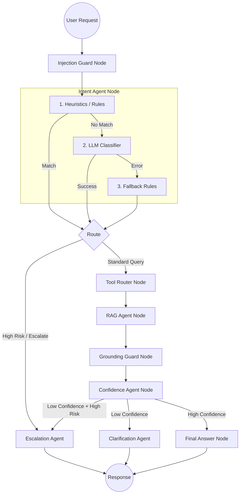
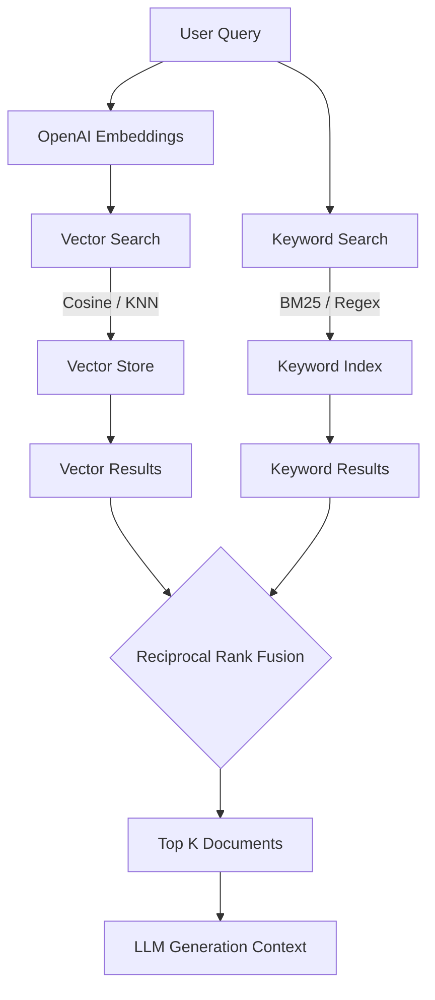

# 💳 VSmartPay AI Support Agent


**VSmartPay AI Support Agent** là hệ thống backend cung cấp trợ lý ảo (AI Support Agent) phục vụ chăm sóc khách hàng cho ví điện tử giả lập VSmartPay. Dự án ứng dụng kiến trúc RAG (Retrieval-Augmented Generation), điều phối đa tác nhân bằng LangGraph và tích hợp hệ thống tài chính mô phỏng (ví, giao dịch).

---

## 🚀 Tính năng nổi bật (Features)

### 🧠 Core AI & Chatbot Capabilities
- **Bảo mật & Guardrails Tích Hợp**: 
  - *Injection Guard*: Chủ động chặn đứng các nỗ lực Prompt Injection, Jailbreak, hoặc ngôn từ độc hại từ người dùng trước khi đưa vào LLM.
  - *Grounding Guard*: Đảm bảo Chatbot không bịa đặt (hallucinate) thông tin. Mọi câu trả lời đều phải dựa trên ngữ cảnh được Retrieval (RAG).
- **Phân loại Intent & Nhận diện Công cụ (Tool Calling)**: Sử dụng Function Calling để nhận diện chính xác ý định (Intent) của người dùng (Hỏi đáp, Số dư, Chuyển tiền, Báo lỗi) và tự động gọi các công cụ (Mock Financial Tools) tương ứng.
- **Tự động Chuyển giao (Human Handoff/Escalation)**: Nhận biết ngưỡng rủi ro và độ tự tin (Confidence Level). Nếu người dùng báo cáo gian lận (Fraud) hoặc Chatbot không chắc chắn (< 60% Confidence), luồng LangGraph sẽ tự động ngắt và đẩy (escalate) phiên chat sang trạng thái `WAITING_HUMAN` cho tư vấn viên thật xử lý.
- **Bảo vệ Dữ liệu Cá nhân (PII Masking)**: Ẩn/Mask thông tin nhạy cảm (như số điện thoại, email) trước khi gửi prompt lên OpenAI.
- **Điều phối Đa Tác Nhân (LangGraph Orchestration)**: Tách biệt tư duy của LLM thành các Node xử lý chuyên biệt (Intent, Router, RAG, Confidence, Clarification), giúp dễ debug và mở rộng logic.
- **Dynamic Metadata Filtering & Fallback Retrieval**: Hệ thống RAG không chỉ tìm kiếm mù quáng, mà còn biết dùng metadata (`agent_scope`, `kb_type`, `category`) để khoanh vùng tài liệu chính xác theo Intent. Nếu tìm kiếm với filter khắt khe (strict search) không có kết quả, hệ thống có cơ chế Fallback tự động tìm kiếm trên toàn bộ Knowledge Base để không bỏ lót thông tin.

### 💼 Nền tảng Ví Điện Tử & Backend
- **RAG & Knowledge Base**: Lưu trữ, phân mảnh (chunking) và tìm kiếm thông tin nghiệp vụ nội bộ (PDF, DOCX).
- **Auth & Quản lý Tài khoản**: Đăng ký, đăng nhập (JWT), quản lý người dùng (Users) và Ví (Wallets).
- **Hệ thống Tài chính (Mock Financial Tools)**: Mô phỏng nạp (Deposit), rút (Withdrawal), chuyển khoản (Transfer) và tính phí (Fees).
- **Vector Search & Tracing**: Tích hợp FAISS / MongoDB Atlas Vector Search và giám sát luồng bằng LangSmith.

---

## 🛠️ Công nghệ sử dụng (Tech Stack)

- **Backend**: FastAPI (Python 3.11+), Uvicorn.
- **Database**: MongoDB (Async Motor, PyMongo).
- **Auth & Security**: JWT (python-jose), Bcrypt (passlib).
- **AI & RAG**: OpenAI (gpt-4o-mini, text-embedding-3-small), LangChain, LangGraph.
- **Vector Store**: FAISS (CPU) / MongoDB Atlas Vector Search.
- **Document Processing**: PyMuPDF, pypdf, python-docx.
- **Testing**: Pytest, pytest-asyncio, httpx.

---

## 🗺️ Kiến trúc Tổng quan (Architecture)

### 1. LangGraph Multi-Agent Orchestration
Kiến trúc này định tuyến các luồng xử lý thông minh, đảm bảo an toàn (guardrails) và tự động rẽ nhánh.



### 2. Hybrid Search & RAG Workflow
Hệ thống sử dụng Hybrid Search kết hợp giữa tìm kiếm Vector (ngữ nghĩa) và tìm kiếm Keyword (từ khóa), sau đó trộn kết quả bằng Reciprocal Rank Fusion (RRF).



### 3. Tracing với LangSmith
Hệ thống tích hợp sẵn luồng giám sát chi tiết thông qua **LangSmith**, cho phép track từng Node trong LangGraph, độ trễ (latency), Token usage và Retrieval trace. Có thể bật tắt thông qua cấu hình `LANGSMITH_TRACING` trong file `.env`.

---

## 📂 Cấu trúc Dự án (Project Structure)

```text
app/
├── api/             # Nơi gom (include) toàn bộ các router
├── core/            # Lifespan startup, Exception handlers global
├── common/          # Constant (Enum), Exception tuỳ chỉnh, Response formatter, Utils
├── modules/
│   ├── auth/        # Đăng nhập, tạo session JWT
│   ├── users/       # Quản lý người dùng, KYC
│   ├── wallets/     # Tạo ví, kiểm tra số dư
│   ├── transactions/# Thực hiện Deposit, Withdrawal, Transfer
│   ├── fees/        # Tính toán phí giao dịch
│   ├── documents/   # Quản lý, tải lên và chunking tài liệu
│   ├── rag/         # Vector Store (FAISS/MongoDB), Embeddings
│   ├── tools/       # Các công cụ hỗ trợ RAG/Chat
│   └── chat/        # Logic giao tiếp với LLM, LangGraph
├── config.py        # Settings cấu hình toàn cục (Pydantic Settings)
├── database.py      # Connection manager kết nối MongoDB Async
└── main.py          # FastAPI Entrypoint
```

---

## ⚙️ Biến Môi trường (Environment Variables)

Hệ thống cấu hình thông qua file `.env` (tham khảo `.env.example`).
**Đặc biệt lưu ý**: Biến `SECRET_KEY` là **bắt buộc** để ký mã hóa JWT. Không dùng key mặc định cho môi trường chạy thật.

*Gợi ý tạo SECRET_KEY ngẫu nhiên:*
```bash
python -c "import secrets; print(secrets.token_urlsafe(32))"
```

Một số biến quan trọng khác:
- `MONGODB_URL`: Chuỗi kết nối MongoDB.
- `DATABASE_NAME`: Tên database.
- `OPENAI_API_KEY`: Bắt buộc để sử dụng tính năng Chat và Embeddings.
- `VECTOR_STORE`: Chọn `faiss` hoặc `atlas`.
- `USE_LANGGRAPH`: `True`/`False` để bật tắt LangGraph orchestration.
- `LANGSMITH_TRACING`: `True` nếu muốn log luồng suy luận lên LangSmith.

---

## 📥 Cài đặt (Installation)

1. **Clone repository:**
   ```bash
   git clone <repo-url>
   cd vsmartpay-ai-support-agent
   ```

2. **Tạo và kích hoạt Virtual Environment:**
   ```bash
   python -m venv venv
   
   # Windows:
   .\venv\Scripts\Activate.ps1
   
   # macOS/Linux:
   source venv/bin/activate
   ```

3. **Cài đặt thư viện:**
   ```bash
   pip install -r requirements.txt
   ```

4. **Tạo cấu hình môi trường:**
   ```bash
   cp .env.example .env
   # Hãy cập nhật MONGODB_URL, OPENAI_API_KEY và SECRET_KEY trong file .env
   ```

---

## 🚀 Chạy ứng dụng (Running the App)

- **Lệnh chạy local server:**
  ```bash
  uvicorn app.main:app --reload --host 127.0.0.1 --port 8000
  ```

- **Swagger UI (Tài liệu API tương tác):**
  Truy cập: [http://localhost:8000/docs](http://localhost:8000/docs)

- **Health Check Endpoint:**
  ```text
  GET http://localhost:8000/health
  ```

---

## 🔗 Tổng quan API (API Overview)

Hệ thống tuân theo thiết kế RESTful, chia theo từng phân hệ. Một số API chính:

- **Auth**: `/api/v1/login` (cấp phát JWT token).
- **Users**: `/api/v1/users` (đăng ký, lấy thông tin cá nhân).
- **Wallets**: `/api/v1/wallets` (tạo ví mặc định, tra cứu số dư).
- **Transactions**: `/api/v1/transactions` (nạp, rút, chuyển khoản).
- **Fees**: `/api/v1/fees` (tra cứu biểu phí giao dịch).
- **Documents**: `/api/v1/documents` (quản lý, tải lên tài liệu phục vụ RAG).
- **Chat**: `/chat` (tương tác trực tiếp với trợ lý ảo).

---

## 🧪 Kiểm thử (Testing)

Dự án sở hữu bộ test toàn diện. Hầu hết các test giao tiếp với database đều được mock để có thể chạy offline độc lập với cấu hình môi trường gốc.
Để chạy test:
```bash
pytest
```

---

## ⚠️ Lưu ý & Giới hạn (Notes / Limitations)

- Đây là hệ thống backend **mô phỏng** phục vụ mục đích học tập và nghiên cứu kiến trúc Fintech/AI. **TUYỆT ĐỐI KHÔNG** dùng cho các hệ thống Core Banking hay ứng dụng thanh toán tiền thật trên production.
- Các giao dịch (transactions), tính toán biểu phí (fees) chỉ là logic mock/simulation dựa trên mô hình ví cơ bản.
- Yêu cầu phải có kết nối Internet để gọi OpenAI API, và một cluster MongoDB thực tế (khuyên dùng MongoDB Atlas) nếu muốn dùng Atlas Vector Search.

---

Số điện thoại: 0909090909
Mật khẩu: adminpassword123
Vai trò: admin
Ví liên kết: wlt_admin_cskh (Số dư khởi tạo: 10.000.000 VND)